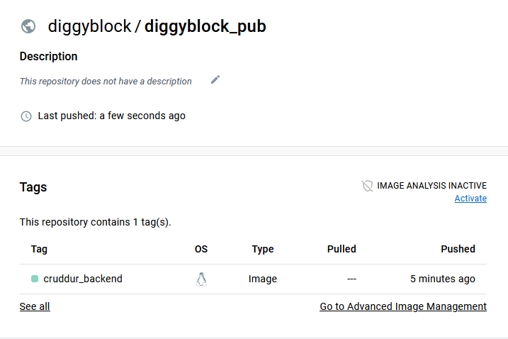
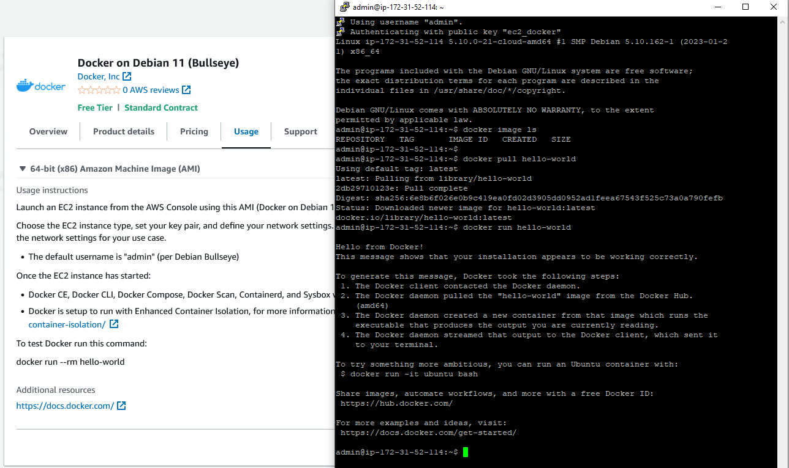

# Week 1 — App Containerization

## Gitpod Issue and fix

I had an issue with the AWS CLI not being installed for each GitPod session, even though it was in the init section in gitpod.yml. I saw talk in the discord about creating a custom workspace using a gitpod dockerfile, so I decided to go that route. I have a simple ".gitpod.dockerfile" that starts with the normal gitpod workspace image, and then installs AWS CLI, Postgres and does NPM install on the frontend react app folder. The first run of the workspace after this took a while to build but subsequent starts are fast.

### Update on custom gitpod workspace
I reverted back to NOT using a custom gitpod image because it was taking much too long to spin up my CDE. Maybe 5 minutes versus a few seconds.

## Homework Challenges
### Run dockerfile CMD as external script
I was not 100% clear on what was intended on this one, but I decided to create a shell script that allows you to pass "up" or "down" to and it then runs the corresponding docker compose command.
##### Shell Script:

### Push and tag an image to Docker Hub
I liked this idea so I referred to the instructions at [This page](https://docs.docker.com/docker-hub/repos/) of the docker docs to see how to create a repository and push an image to it. I decided to build and tag the cruddur backend image (backend_flask) and push that to my public docker hub repo. [Link to my Docker Hub Repo](https://hub.docker.com/repository/docker/diggyblock/diggyblock_pub/general)
I ran into one issue when trying to push to docker hub and that was not having permission. I had to search just a minute before finding the "docker login" command which I used on the command line in GitPod to provide my credentials. The push then worked fine.
##### Docker Hub:

### Launch an EC2 instance that has docker installed...
... and pull a container to demonstrate you can run your own docker processes
For this one, I went into the AWS console, EC2 service, and searched for an AMI that had docker. I found an AMI by docker that had Debian and Docker. I launched an EC2 instance using this AMI. I also created a key pair to use with this instance and downloaded it as a putty ppk. Upon first trying to login using putty, I got an error. I checked the Usage instructions on the AMI, and it noted we must use the "admin" username rather than standard "ec2-user". This worked. I then pulled down the docker hello-world image and ran it:

