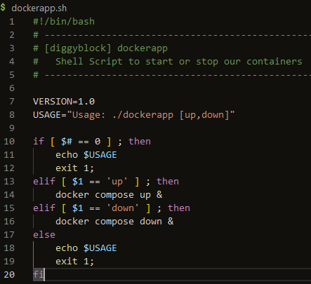

# Week 1 — App Containerization

## Gitpod Issue and fix

I had an issue with the AWS CLI not being installed for each GitPod session, even though it was in the init section in gitpod.yml. I saw talk in the discord about creating a custom workspace using a gitpod dockerfile, so I decided to go that route. I have a simple gitpod dockerfile that starts with the normal gitpod workspace image, and then installs AWS CLI, Postgres and does NPM install on the frontend react app folder. The first run of the workspace after this took a while but subsequent starts are fast.

## Homework Challenges
### Run dockerfile CMD as external script
I was not 100% clear on what was intended on this one, but I decided to create a shell script that allows you to pass "up" or "down" to and it then runs the corresponding docker compose command
##### Image:

### Push and tag an image to Docker Hub
I liked this idea so I referred to the instructions at [This page](https://docs.docker.com/docker-hub/repos/) of the docker docs to see how to create a repository and push an image to it. I decided to build and tag the cruddur backend image (backend_flask) and push that to my public docker hub repo. [Link to my Docker Hub Repo](https://hub.docker.com/repository/docker/diggyblock/diggyblock_pub/general)
I ran into one issue when trying to push to docker hub and that was not having permission. I had to search just a minute before finding the "docker login" command which I used on the command line in GitPod to provide my credentials. The push then worked fine.
