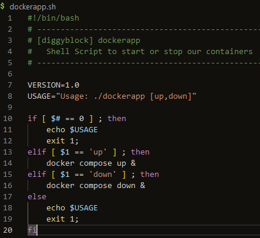

# Week 1 — App Containerization

## Gitpod Issue and fix

I had an issue with the AWS CLI not being installed for each GitPod session, even though it was in the init section in gitpod.yml. I saw talk in the discord about creating a custom workspace using a gitpod dockerfile, so I decided to go that route. I have a simple gitpod dockerfile that starts with the normal gitpod workspace image, and then installs AWS CLI, Postgres and does NPM install on the frontend react app folder. The first run of the workspace after this took a while but subsequent starts are fast.

## Homework Challenges
### Run dockerfile CMD as external script
I was not 100% clear on what was intended on this one, but I decided to create a shell script that allows you to pass "up" or "down" to and it then runs the corresponding docker compose command
##### Image:

