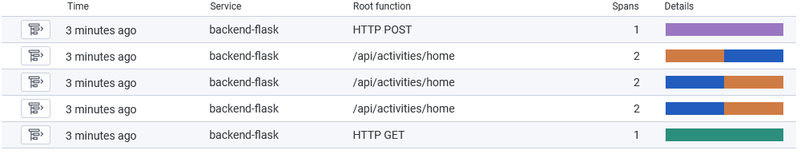
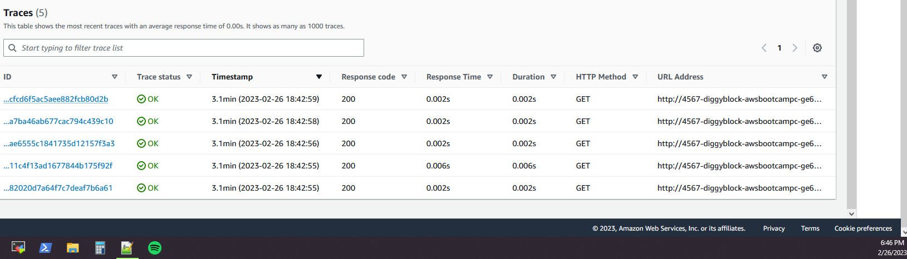
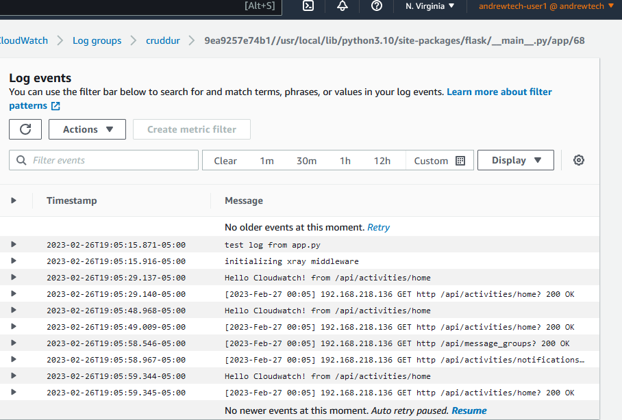

# Week 2 — Distributed Tracing

## Intro
Wow! The bootcamp is going full steam ahead and not looking back! That's a good thing as it's forcing me to think and learn. On Week 0, I thought oh this will be easy, I probably won't learn anything. HA! Not so, and again that is a good thing.

## Issues
### Gitpod
Last week I had started using a custom gitpod workspace, but it was just taking too long to load the CDE due to build times and I know that would annoy not only myself but Andrew as well (and whoever assists grading) so I reverted back to using just the gitpod.yml statements to install AWS CLI, etc. I changed the AWS install to a "before" statement insetad of an init statement, and also added a line to remove the zip file when done, after I realized that upon starting the environment, it was getting stuck on a prompt asking if I wanted to overwrite the AWS zip file.

## Homework
I've completed the coding from the main video, the Xray video and CloudWatch video. I committed those changes then made another commit to comment them out to avoid too much spend. I'll be updating this journal as I move along with other tasks.

### Honeycomb

### AWS X-Ray
After adding the X-Ray code, my backend was not starting up. I went to the Docker extension in GitPod, and checked the logs for the backend container. It was showing an error: `NameError: name 'app' is not defined`. I went back to app.py to check, and noticed I had the X-Ray code before the definition `app = Flask(__name__)`. I moved the X-Ray code to be after this and the container starts up.

The app is successfully sending data to AWS X-Ray:

### AWS CloudWatch
I added the code for the CloudWatch logging to the app. I did not encounter any issues on this one.

The app is successfully sending data to AWS CloudWatch:
